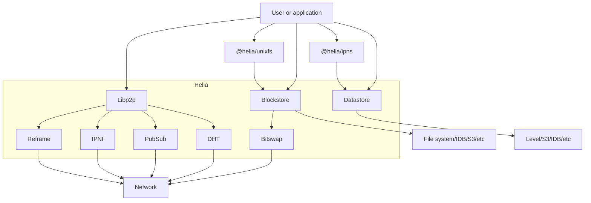

  

# helia <!-- omit in toc -->

## Table of contents <!-- omit in toc -->

- [🥅 Purpose and goals](#-purpose-and-goals)
- [🏃‍♀️ Getting Started](#️-getting-started)
- [📒 API Docs](#-api-docs)
- [📐 System diagram](#-system-diagram)
- [🏭 Code Structure](#-code-structure)
- [📣 Project status](#-project-status)
- [🛣️ Roadmap](#️-roadmap)
- [👫 Get involved](#-get-involved)
  - [🤲 Contribute](#-contribute)
- [🛍️ Notable Consumers/Users](#️-notable-consumersusers)
- [🌞 Name](#-name)
- [🪪 License](#-license)

## 🥅 Purpose and goals

A lean, modular, and modern implementation of IPFS for the prolific JS and browser environments.

See the [Manifesto](./MANIFESTO.md), the [FAQ](./FAQ.md), and the [State of IPFS in JS blog post from October 2022](https://blog.ipfs.tech/state-of-ipfs-in-js/) for more info.

## 🏃‍♀️ Getting Started

Check out the [Helia examples repo](https://github.com/ipfs-examples/helia-examples#examples), which covers a wide variety of use cases. If you feel something has been missed, follow the [contribution guide](https://github.com/ipfs-examples/helia-examples#contributing) and create a PR to the examples repo.

## 📒 API Docs

- https://ipfs.github.io/helia

## 📐 System diagram

## 🏭 Code Structure
Helia embraces a modular approach and encourages users to bring their own implementations of interfacing libraries to suit their needs. Helia also ships supplemental libraries and tools including:

- [`@helia/UnixFS`](https://github.com/ipfs/helia-unixfs)
- [`@helia/ipns`](https://github.com/ipfs/helia-ipns)

These libraries are by no means the "one true implementation", but instead instead provide optionality depending on one's needs.

This repo itself is made up of these packages:
- [`/packages/interface`](./packages/interface) The Helia API
- [`/packages/helia`](./packages/helia) An implementation of the Helia API
- [`/packages/interop`](./packages/interop) Interop tests for Helia

## 📣 Project status
Helia v1 shipped in 202303 (see [releases](https://github.com/ipfs/helia/releases)), and development keeps on trucking as we work on initiatives in the [roadmap](#roadmap) and make performance improvements and bug fixes along the way.

## 🛣️ Roadmap
Please find and comment on [the Roadmap here](https://github.com/ipfs/helia/issues/5).

## 👫 Get involved
* Watch our Helia Demo Day presentations [here](https://www.youtube.com/playlist?list=PLuhRWgmPaHtQAnt8INOe5-kV9TLVaUJ9v)
* We are sharing about the progress at periodic [Helia Demos](https://lu.ma/helia).  This is a good place to find out the latest and learn of ways to get involved.  We'd love to see you there!
* Pick up one of the [issues](https://github.com/ipfs/helia/issues).
* Come chat in Filecoin Slack #ip-js.  (Yes, we should bridge this to other chat enviornments.  Please comment [here](https://github.com/ipfs/helia/issues/33) if you'd like this.)

### 🤲 Contribute

Contributions welcome! Please check out [the issues](https://github.com/ipfs/helia/issues).

Also see our [contributing document](https://github.com/ipfs/community/blob/master/CONTRIBUTING_JS.md) for more information on how we work, and about contributing in general.

Please be aware that all interactions related to this repo are subject to the IPFS [Code of Conduct](https://github.com/ipfs/community/blob/master/code-of-conduct.md).

Unless you explicitly state otherwise, any contribution intentionally submitted for inclusion in the work by you, as defined in the Apache-2.0 license, shall be dual licensed as above, without any additional terms or conditions.

## 🛍️ Notable Consumers/Users

*<YOUR LOGO HERE>*

Helia is in its early days.  If you're using Helia in production or have a novel usecase, we'd love to hear.  Please open an issue so we can learn more!

## 🌞 Name

Helia (*HEE-lee-ah*) is the Latin spelling of Ἡλιη -- in Greek mythology, one of the [Heliades](https://www.wikidata.org/wiki/Q12656412): the daughters of the sun god Helios. When their brother Phaethon died trying to drive the sun chariot across the sky, their tears of mourning fell to earth as amber, which is yellow (sort of), and so is JavaScript. They were then turned into [poplar](https://en.wiktionary.org/wiki/poplar) trees and, well, JavaScript is quite popular.

In Oct–Dec 2022, [PL EngRes IP Stewards](https://pl-strflt.notion.site/IP-Stewards-9b65f88602474557b5d6f644194e941f) [sought community input](https://github.com/ipfs/pomegranate/issues/3) for the name of this project. After considering 20 suggestions and holding a couple of polls, the name **Helia** was chosen. Here's [why "ipfs" is not in the name](https://github.com/ipfs/ipfs/issues/470).

## 🪪 License

Licensed under either of

- Apache 2.0, ([LICENSE-APACHE](LICENSE-APACHE) / <http://www.apache.org/licenses/LICENSE-2.0>)
- MIT ([LICENSE-MIT](LICENSE-MIT) / <http://opensource.org/licenses/MIT>)
