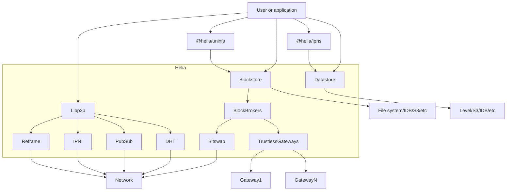

<p align="center">
  <a href="https://github.com/ipfs/helia" title="Helia">
    
  </a>
</p>

[](https://ipfs.tech)
[](https://discuss.ipfs.tech)
[](https://codecov.io/gh/ipfs/helia)
[](https://github.com/ipfs/helia/actions/workflows/main.yml?query=branch%3Amain)

[Helia](https://github.com/ipfs/helia) is a lean, modular, and modern TypeScript implementation of IPFS for the prolific JS and browser environments.

See the [Manifesto](https://github.com/ipfs/helia/wiki/Manifesto), the [FAQ](https://github.com/ipfs/helia/wiki/FAQ), and the [State of IPFS in JS blog post from October 2022](https://blog.ipfs.tech/state-of-ipfs-in-js/) for more info.

# 🌟 Usage

A quick overview of how to get different types of data in and out of your Helia
node.

## 🪢 Strings

You can use the [@helia/strings](https://www.npmjs.com/package/@helia/strings)
module to easily add and get strings from your Helia node:

```js
import { createHelia } from 'helia'
import { strings } from '@helia/strings'

const helia = await createHelia()
const s = strings(helia)

const myImmutableAddress = await s.add('hello world')

console.log(await s.get(myImmutableAddress))
// hello world
```

## 🌃 JSON

The [@helia/json](https://www.npmjs.com/package/@helia/json) module lets you add
or get plain JS objects:

```js
import { createHelia } from 'helia'
import { json } from '@helia/json'

const helia = await createHelia()
const j = json(helia)

const myImmutableAddress = await j.add({ hello: 'world' })

console.log(await j.get(myImmutableAddress))
// { hello: 'world' }
```

## 🌠 DAG-JSON

The [@helia/dag-json](https://www.npmjs.com/package/@helia/dag-json) allows you
to store references to linked objects as
[CIDs](https://docs.ipfs.tech/concepts/content-addressing):

```js
import { createHelia } from 'helia'
import { dagJson } from '@helia/dag-json'

const helia = await createHelia()
const d = dagJson(helia)

const object1 = { hello: 'world' }
const myImmutableAddress1 = await d.add(object1)

const object2 = { link: myImmutableAddress1 }
const myImmutableAddress2 = await d.add(object2)

const retrievedObject = await d.get(myImmutableAddress2)
console.log(retrievedObject)
// { link: CID(baguqeerasor...) }

console.log(await d.get(retrievedObject.link))
// { hello: 'world' }
```

## 🌌 DAG-CBOR

[@helia/dag-cbor](https://www.npmjs.com/package/@helia/dag-cbor) works in a
similar way to `@helia/dag-json` but stores objects using
[Concise Binary Object Representation](https://cbor.io/):

```js
import { createHelia } from 'helia'
import { dagCbor } from '@helia/dag-cbor'

const helia = await createHelia()
const d = dagCbor(helia)

const object1 = { hello: 'world' }
const myImmutableAddress1 = await d.add(object1)

const object2 = { link: myImmutableAddress1 }
const myImmutableAddress2 = await d.add(object2)

const retrievedObject = await d.get(myImmutableAddress2)
console.log(retrievedObject)
// { link: CID(baguqeerasor...) }

console.log(await d.get(retrievedObject.link))
// { hello: 'world' }
```

# 🐾 Next steps

Check out the [helia-examples](https://github.com/ipfs-examples/helia-examples)
repo for how to do mostly anything with your Helia node.

# 🏃‍♀️ Getting Started

Check out the [Helia examples repo](https://github.com/ipfs-examples/helia-examples#examples), which covers a wide variety of use cases. If you feel something has been missed, follow the [contribution guide](https://github.com/ipfs-examples/helia-examples#contributing) and create a PR to the examples repo.

# 📗 Project Docs

- See the [project wiki](https://github.com/ipfs/helia/wiki).

# 📒 API Docs

- https://ipfs.github.io/helia

# 📐 System diagram



# 🏭 Code Structure

Helia embraces a modular approach and encourages users to bring their own implementations of various APIs to suit their needs.

The basic Helia API is defined in:

- [`/packages/interface`](./packages/interface) The Helia API

The API is implemented by:

- [`/packages/helia`](./packages/helia) An implementation of the Helia API

Helia also ships a number of supplemental libraries and tools.

These libraries are not intended to be the "one true implementation" of any given API, but are made available for users to include depending on the need of their particular application:

- [./packages/unixfs](./packages/unixfs) The `@helia/unixfs` module
- [./packages/mfs](./packages/mfs) The `@helia/mfs` module
- [./packages/ipns](./packages/ipns) `@helia/ipns`
- [./packages/car](./packages/car) `@helia/car`
- [./packages/strings](./packages/strings) `@helia/strings`
- [./packages/json](./packages/json) `@helia/json`
- [./packages/dag-json](./packages/dag-json) `@helia/dag-json`
- [./packages/dag-cbor](./packages/dag-cbor) `@helia/dag-cbor`

An interface suite ensures everything is compatible:

- [`/packages/interop`](./packages/interop) Interop tests for Helia

## Other modules

There are several other modules available outside this repo:

- [`@helia/delegated-routing-v1-http-api`](https://github.com/ipfs/helia-delegated-routing-v1-http-api) An implementation of the [Delegated Routing v1 HTTP API](https://specs.ipfs.tech/routing/http-routing-v1/) including a server and a client
- [Helia WNFS](https://github.com/shovelers/helia-wnfs) a [WNFS](https://guide.fission.codes/developers/webnative/file-system-wnfs) implementation built on top of Helia
- [`@helia/remote-pinning`](https://github.com/ipfs/helia-remote-pinning) A Helia client for communicating with [IPFS Pinning Services](https://ipfs.github.io/pinning-services-api-spec/)
- [`@helia/http-gateway`](https://github.com/ipfs/helia-http-gateway) An implentation of the [IPFS HTTP Gateway API](https://docs.ipfs.tech/concepts/ipfs-gateway/#gateway-types) built with Helia

# 📣 Project status

Helia v1 shipped in 202303 (see [releases](https://github.com/ipfs/helia/releases)), and development keeps on trucking as we work on initiatives in the [roadmap](#roadmap) and make performance improvements and bug fixes along the way.

# 🛣️ Roadmap

Please find and comment on [the Roadmap here](https://github.com/ipfs/helia/issues/5).

# 👫 Get involved

- Watch our Helia Demo Day presentations [here](https://www.youtube.com/playlist?list=PLuhRWgmPaHtQAnt8INOe5-kV9TLVaUJ9v)
- We are sharing about the progress at periodic [Helia Demos](https://lu.ma/helia).  This is a good place to find out the latest and learn of ways to get involved.  We'd love to see you there!
- Pick up one of the [issues](https://github.com/ipfs/helia/issues).
- Come chat in Filecoin Slack #ip-js.  (Yes, we should bridge this to other chat environments.  Please comment [here](https://github.com/ipfs/helia/issues/33) if you'd like this.)

# 🤲 Contribute

Contributions welcome! Please check out [the issues](https://github.com/ipfs/helia/issues).

Also see our [contributing document](https://github.com/ipfs/community/blob/master/CONTRIBUTING_JS.md) for more information on how we work, and about contributing in general.

Please be aware that all interactions related to this repo are subject to the IPFS [Code of Conduct](https://github.com/ipfs/community/blob/master/code-of-conduct.md).

Unless you explicitly state otherwise, any contribution intentionally submitted for inclusion in the work by you, as defined in the Apache-2.0 license, shall be dual licensed as above, without any additional terms or conditions.

[](https://github.com/ipfs/community/blob/master/CONTRIBUTING.md)

# 🛍️ Notable Consumers/Users

- See [Projects using Helia](https://github.com/ipfs/helia/wiki/Projects-using-Helia).

# 🌞 Branding

- See [Branding](https://github.com/ipfs/helia/wiki/Branding).

# 🪪 License

Licensed under either of

- Apache 2.0, ([LICENSE-APACHE](LICENSE-APACHE) / <http://www.apache.org/licenses/LICENSE-2.0>)
- MIT ([LICENSE-MIT](LICENSE-MIT) / <http://opensource.org/licenses/MIT>)
